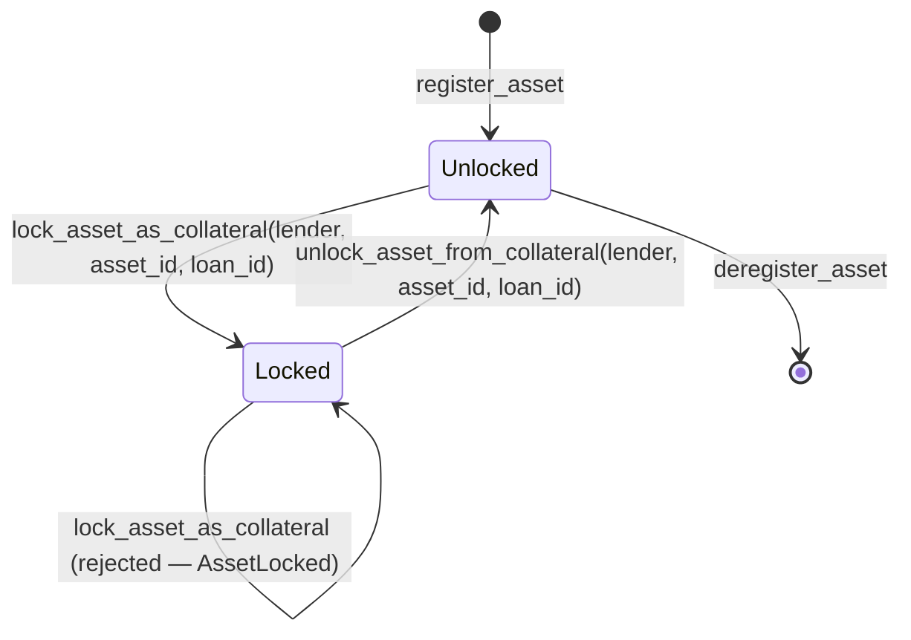
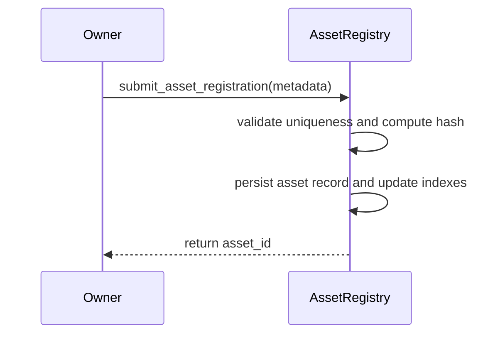
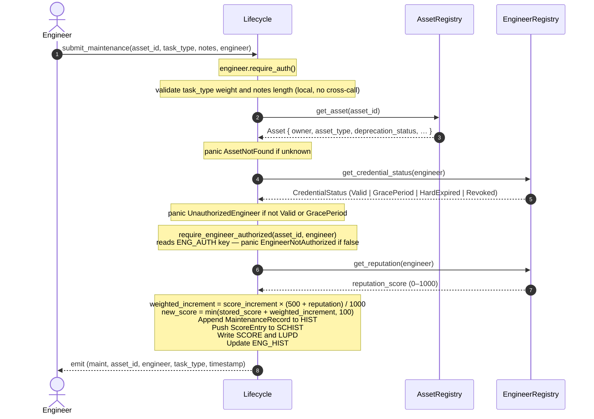
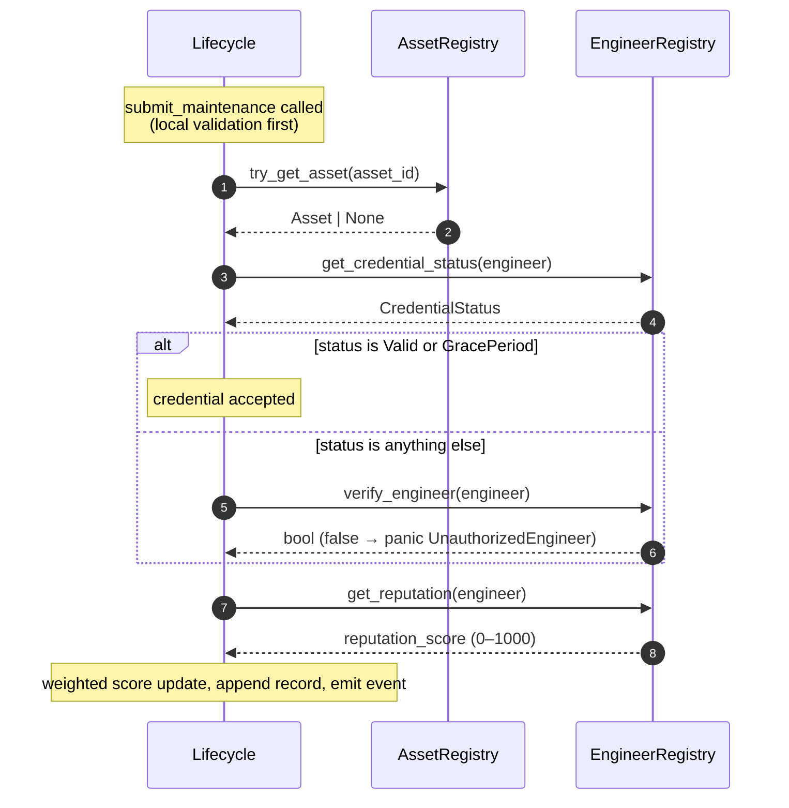

# Architecture Overview

Mainstay is composed of four independent Soroban smart contracts deployed on the Stellar network: **AssetRegistry**, **EngineerRegistry**, **Lifecycle**, and **Lending**. Each contract owns a distinct domain and exposes a minimal public interface. The Lifecycle contract cross-calls AssetRegistry and EngineerRegistry; a lender integration cross-calls AssetRegistry and Lifecycle directly (see [Lending](#lending) below) rather than routing loan logic through Lifecycle.

---

## Contracts

### AssetRegistry

Maintains the canonical registry of industrial assets.

**Responsibilities:**
- Register assets with a unique sequential ID (`asset_count` counter)
- Store asset metadata (type, owner, registration timestamp)
- Enforce per-owner deduplication via SHA-256 hash of metadata
- Track owner → asset ID index for reverse lookups
- Support ownership transfer and metadata updates
- Admin-gated upgrade path

**Key storage:**
| Key | Type | Description |
|-----|------|-------------|
| `(ASSET, id)` | `Asset` | Asset record |
| `(DEDUP, owner, hash)` | `u64` | Dedup guard → asset ID |
| `(OWN_IDX, owner)` | `Vec<u64>` | Owner's asset IDs |
| `A_COUNT` | `u64` | Monotonic asset ID counter |

---

### EngineerRegistry

Manages engineer credentials issued by trusted issuers.

**Responsibilities:**
- Maintain a whitelist of trusted credential issuers (admin-managed)
- Allow trusted issuers to register engineers with a credential hash and validity period
- Expose `verify_engineer` — returns `true` only if the credential is active and not expired
- Support credential revocation by the original issuer
- Track issuer → engineer index

**Key storage:**
| Key | Type | Description |
|-----|------|-------------|
| `(ENG, address)` | `Engineer` | Credential record |
| `(TRUSTED, issuer)` | `bool` | Trusted issuer flag |
| `(ISS_ENGS, issuer)` | `Vec<Address>` | Issuer's engineers |

---

### Lifecycle

The orchestration contract. Binds AssetRegistry and EngineerRegistry together to produce a verifiable maintenance audit trail and collateral score for each asset.

**Responsibilities:**
- Accept maintenance submissions from engineers
- Cross-call AssetRegistry to confirm the asset exists
- Cross-call EngineerRegistry to confirm the engineer's credential is active
- Append immutable `MaintenanceRecord` entries to per-asset history (capped at `max_history`, default 200)
- Compute and update a collateral score (0–100) per asset based on task weights
- Record a `ScoreEntry` snapshot (timestamp + score) on every maintenance event
- Apply time-based score decay when `decay_score` is called
- Expose score trend queries (`get_score_trend`, `get_score_history`)
- Admin-gated configuration updates (score increment, decay rate/interval) and upgrade path

**Task weight table:**
| Tasks | Points |
|-------|--------|
| `OIL_CHG`, `LUBE`, `INSPECT` | 2 |
| `FILTER`, `TUNE_UP`, `BRAKE` | 5 |
| `ENGINE`, `OVERHAUL`, `REBUILD` | 10 |
| (any other) | 3 |

**Key storage:**
| Key | Type | Description |
|-----|------|-------------|
| `(HIST, asset_id)` | `Vec<MaintenanceRecord>` | Full maintenance history |
| `(SCORE, asset_id)` | `u32` | Current collateral score |
| `(SCHIST, asset_id)` | `Vec<ScoreEntry>` | Score snapshots over time |
| `(LUPD, asset_id)` | `u64` | Timestamp of last maintenance |
| `CONFIG` | `Config` | Admin, scoring, and decay config |
| `REGISTRY` | `Address` | Bound AssetRegistry address |
| `ENG_REG` | `Address` | Bound EngineerRegistry address |

---

### Lending

The Lending contract implements a peer-vouched, over-collateralized micro-loan system that uses assets registered in `AssetRegistry` (verified via `Lifecycle` collateral scores) as security for loans. Unlike Lifecycle, Lending does **not** cross-call the other contracts autonomously — the lender's off-chain integration is responsible for querying `AssetRegistry`/`Lifecycle` and then calling `Lending` directly. See the [Lender Integration Guide](lender-integration-guide.md) for the full lender-side sequence.

**Responsibilities:**
- Accept vouches (staked backing) for a borrower from third parties
- Disburse loans against a borrower's staked vouches, up to `max_loan_amount`
- Track loan status (`Active`, `Repaid`, `Defaulted`) and enforce a single active loan per borrower
- Apply yield to vouchers on successful repayment and slash a configurable percentage on default
- Record and release **liens** — on-chain claims that a lender holds against a specific asset for a specific loan
- Admin-gated configuration (yield/slash basis points, minimum stake, loan duration) and pause/unpause

**Key storage:**
| Key | Type | Description |
|-----|------|-------------|
| `(LOAN, borrower)` | `Loan` | Active loan record (amount, status, deadline) |
| `(VOUCHES, borrower)` | `Vec<Vouch>` | All active voucher stakes for a borrower |
| `(V_HIST, voucher)` | `VoucherHistory` | Running yield/slash totals per voucher |
| `(Liens, asset_id)` | `Vec<LienRecord>` | Active lien claims recorded against an asset |
| `L_COUNT` / `(L_MAP, loan_id)` | `u64` / `Address` | Loan ID counter and loan-ID → borrower lookup |
| `CONFIG` | `Config` | Yield BPS, slash BPS, min stake, loan duration |

The full storage layout and TTL policy for every key above is documented in [docs/ttl-strategy.md](ttl-strategy.md#4-lending-contract); the full error catalogue is in [docs/error-reference.md](error-reference.md#lending).

#### Lien System

A **lien** (`LienRecord`) is the Lending contract's on-chain evidence that a specific lender holds a claim against a specific asset for a specific loan. Liens are keyed by `asset_id` and store `{ lender, loan_id, amount, created_at }`. They exist independently of the `is_locked` flag on the asset itself (see [Asset Lock/Unlock Lifecycle](#asset-lockunlock-lifecycle) below) — a lien is the *claim record*, while the lock is the *enforcement mechanism* that physically prevents the asset from being transferred or re-collateralized while claims exist against it.

- `record_lien(admin, asset_id, lender, loan_id, amount)` — appends a `LienRecord`, guarded against duplicate `(lender, loan_id)` pairs, and extends the key's TTL.
- `get_liens(asset_id)` — returns all active liens for an asset; used by lenders to compute total encumbrance before issuing a new loan.
- `release_lien(admin, asset_id, lender, loan_id)` — removes the matching `LienRecord`, typically called after a loan is repaid or after slashing settles a default.

#### Asset Lock/Unlock Lifecycle

To prevent an asset from being double-pledged as collateral while a loan against it is outstanding, `AssetRegistry` exposes a dedicated lock mechanism, separate from the lien bookkeeping in Lending:

1. **Lock** — `AssetRegistry::lock_asset_as_collateral(lender, asset_id, loan_id)` sets `Asset.is_locked = true`. Only the address registered as the authorized lending contract (stored under the dedicated lending-contract key in AssetRegistry) may call this function; any other caller is rejected. Calling it on an asset that is already locked panics with `ContractError::AssetLocked`.
2. **Enforcement** — while `is_locked == true`, asset-mutating operations that would change ownership or metadata in ways that could undermine the lender's claim are rejected with `ContractError::AssetLocked`. This blocks a borrower from transferring or re-pledging an asset out from under an active loan.
3. **Unlock** — `AssetRegistry::unlock_asset_from_collateral(lender, asset_id, loan_id)` sets `Asset.is_locked = false` once the corresponding loan is repaid, defaulted-and-settled, or otherwise closed. Calling it on an asset that is not locked is a no-op guard (rejected rather than silently ignored).
4. A locked asset's `is_locked` flag is independent of any specific lien — an integration should treat `is_locked == true` as "this asset is currently pledged," and cross-check `Lending::get_liens(asset_id)` for the specific claim(s) responsible.



---

## Cross-Contract Call Flow

The Lifecycle contract acts as the main orchestrator and is the only contract that initiates cross-contract calls. Neither `AssetRegistry` nor `EngineerRegistry` calls any other contract.

### Cross-Contract Call Mapping

| Calling Contract | Calling Function | Target Contract | Target Function | Purpose |
|------------------|-------------------|-----------------|-----------------|---------|
| `Lifecycle` | `submit_maintenance` / `batch_submit_maintenance` | `AssetRegistry` | `try_get_asset` | Verifies that the asset exists. Panics with `AssetNotFound` if it does not. |
| `Lifecycle` | `submit_maintenance` / `batch_submit_maintenance` | `EngineerRegistry` | `get_credential_status` | Retrieves the engineer's credential status. |
| `Lifecycle` | `submit_maintenance` / `batch_submit_maintenance` | `EngineerRegistry` | `verify_engineer` | Fallback check called if the status from `get_credential_status` is not `Valid` or `GracePeriod`. Panics with `UnauthorizedEngineer` if verification fails. |
| `Lifecycle` | `submit_maintenance` / `batch_submit_maintenance` | `EngineerRegistry` | `get_reputation` | Fetches the engineer's reputation score to weight the collateral score increment. |
| `Lifecycle` | `record_transfer` | `AssetRegistry` | `try_get_asset` | Verifies that the asset exists. |
| `Lifecycle` | `record_transfer` | `AssetRegistry` | `get_asset` | Fetches the asset to verify that the `new_owner` matches the current owner in the registry. Panics with `UnauthorizedOwner` if they do not match. |
| `Lifecycle` | `get_collateral_score` / `get_collateral_score_batch` | `AssetRegistry` | `try_get_asset` | Verifies that the asset exists. |
| `Lifecycle` | `get_collateral_score` / `get_collateral_score_batch` | `AssetRegistry` | `get_asset` | Fetches the asset to verify that its deprecation status is `Active` (deprecated assets return `0` immediately). |
| *(lender, off-chain)* | loan request flow | `AssetRegistry` | `get_asset` / `get_lifecycle_score` | Verifies asset state and ownership before requesting a loan. |
| *(lender, off-chain)* | loan request flow | `Lifecycle` | `get_collateral_score` | Verifies collateral quality before requesting a loan. |
| *(lender, off-chain)* | after `Lending::request_loan` | `AssetRegistry` | `lock_asset_as_collateral` | Locks the asset (`is_locked = true`) so it cannot be re-pledged or transferred while the loan is outstanding. |
| *(lender, off-chain)* | after loan closure | `AssetRegistry` | `unlock_asset_from_collateral` | Unlocks the asset (`is_locked = false`) once the loan is repaid or the default is settled. |

---

## Sequence Diagrams

### Asset Registration Flow


### Maintenance Submission Flow

The full sequence for `submit_maintenance`. The Lifecycle contract validates the
task type and notes length locally before making any cross-contract calls to
avoid wasting gas on invalid inputs.



### submit_maintenance — Cross-Contract Call Chain

This diagram shows only the contract-to-contract calls triggered by a single
`submit_maintenance` invocation. It omits actor details and internal
computation to make the dependency order clear at a glance.



### Collateral Score Query Flow (with Lazy Decay)

`get_collateral_score` is read-only from the caller's perspective but applies
lazy decay internally and writes the result back so subsequent calls stay
consistent. Two independent scoring models run in parallel; the lower value wins.

```mermaid
sequenceDiagram
    autonumber
    actor Caller
    participant Lifecycle
    participant AssetRegistry

    Caller->>Lifecycle: get_collateral_score(asset_id)

    Lifecycle->>AssetRegistry: get_asset(asset_id)
    AssetRegistry-->>Lifecycle: Asset { deprecation_status, … }
    Note over Lifecycle: return 0 immediately if asset is Deprecated or Decommissioned

    Note over Lifecycle: if FROZEN key is set → return FRZ_SCR (score captured at decommission)

    Note over Lifecycle: — Model A: recency-weighted history score —<br/>Read HIST (Vec&lt;MaintenanceRecord&gt;)<br/>For each record:<br/>  age_ledgers = current_ledger − record_ledger<br/>  recency_weight = max(0, MAX_AGE_LEDGERS − age_ledgers)<br/>  contribution = score_increment × recency_weight / MAX_AGE_LEDGERS<br/>history_score = min(Σ contributions, 100)

    Note over Lifecycle: — Model B: stored score with lazy config decay —<br/>Read SCORE (stored accumulated value)<br/>Read LUPD (timestamp of last write)<br/>elapsed = current_time − last_update<br/>decay_intervals = elapsed / decay_interval<br/>config_score = max(0, stored − decay_intervals × decay_rate)

    Note over Lifecycle: score = min(history_score, config_score)

    Note over Lifecycle: — Floor —<br/>if HIST is non-empty and score &lt; 1:<br/>  score = 1  (MIN_SCORE_WITH_HISTORY)

    Note over Lifecycle: Persist score → SCORE<br/>Persist current timestamp → LUPD

    Lifecycle-->>Caller: return score (0–100)
```

### Loan Request with Collateral Verification

The `Lending` contract does not make cross-contract calls autonomously — a
lender performs collateral verification by calling `Lifecycle` and
`AssetRegistry` directly before submitting a loan request and recording a lien.
The diagram below shows the full off-chain → on-chain sequence a lender
integration must execute.

```mermaid
sequenceDiagram
    autonumber
    actor Lender
    participant AssetRegistry
    participant Lifecycle
    participant Lending

    Lender->>AssetRegistry: get_asset(asset_id)
    AssetRegistry-->>Lender: Asset { owner, deprecation_status, … }
    Note over Lender: reject if asset is None, Deprecated,<br/>or Decommissioned

    Note over Lender: verify asset.owner == borrower address

    Lender->>Lifecycle: get_collateral_score(asset_id)
    Note over Lifecycle: lazy decay applied; reads HIST, SCORE, LUPD
    Lifecycle->>AssetRegistry: get_asset(asset_id)
    AssetRegistry-->>Lifecycle: Asset { deprecation_status, … }
    Note over Lifecycle: return 0 immediately if deprecated
    Lifecycle-->>Lender: score (0–100)
    Note over Lender: reject if score < 50 (configurable threshold)

    Lender->>Lending: get_liens(asset_id)
    Lending-->>Lender: Vec<LienRecord>
    Note over Lender: reject if total encumbrance + loan_amount > asset_value

    Lender->>Lending: request_loan(borrower, amount)
    Note over Lending: borrower.require_auth()<br/>check for existing active loan<br/>verify contract token balance ≥ amount<br/>set deadline = now + loan_duration
    Lending-->>Lender: emit loan_req event; transfer tokens to borrower

    Note over Lender: Admin records lien to secure the claim
    Lender->>Lending: record_lien(admin, asset_id, lender, loan_id, amount)
    Note over Lending: require admin auth<br/>check no duplicate (lender, loan_id)<br/>append LienRecord; extend TTL
    Lending-->>Lender: lien recorded (on-chain claim secured)

    Note over Lender: Lending contract locks the asset so it cannot<br/>be re-pledged or transferred mid-loan
    Lender->>AssetRegistry: lock_asset_as_collateral(lender, asset_id, loan_id)
    Note over AssetRegistry: require caller == authorized lending contract<br/>panic AssetLocked if already locked
    AssetRegistry-->>Lender: asset.is_locked = true

    Note over Lender: — later, on repayment or settled default —
    Lender->>Lending: release_lien(admin, asset_id, lender, loan_id)
    Lending-->>Lender: LienRecord removed
    Lender->>AssetRegistry: unlock_asset_from_collateral(lender, asset_id, loan_id)
    AssetRegistry-->>Lender: asset.is_locked = false
```

---

## Deployment & Initialization

Each contract is deployed independently. After deployment:

1. **AssetRegistry** — call `initialize_admin(admin)`
2. **EngineerRegistry** — call `initialize_admin(admin)`, then `add_trusted_issuer(admin, issuer)`
3. **Lifecycle** — call `initialize(asset_registry_address, engineer_registry_address, admin, max_history)`
4. **Lending** — call `initialize(admin, token_address)`, then configure yield/slash BPS, min stake, and loan duration via the respective `set_*` admin calls

The Lifecycle contract stores the addresses of the other two contracts at initialization time. These addresses are immutable after initialization. The Lending contract is initialized independently and does not store a reference to Lifecycle or EngineerRegistry — a lender's own integration layer is responsible for orchestrating calls across all four contracts (see [Lending](#lending)).

---

## TTL Strategy

All four contracts use Soroban persistent storage and extend TTL by 518,400 ledgers (~30 days) on every write. See [ttl-strategy.md](ttl-strategy.md) for full details, including the Lending contract's lien and loan-tracking keys.

---

## Security Patterns

### Reentrancy Guard on `submit_maintenance` (#1022)

`submit_maintenance` in the Lifecycle contract makes cross-contract calls to the **Asset Registry** (to verify the asset exists and check its status) and the **Engineer Registry** (to verify the engineer's credential and specialization). A malicious registry contract could theoretically re-enter the Lifecycle contract while `submit_maintenance` is still executing — before state is committed — and write duplicate entries to the maintenance history.

To prevent this, `submit_maintenance` uses a **reentrancy lock** stored in Soroban *instance* storage:

```
LOCKED key (instance storage) = true
  ↓
cross-contract calls (asset-registry, engineer-registry)
  ↓
state writes (history, score, last_update)
  ↓
LOCKED key removed
```

**Implementation details:**
- The lock is stored under the symbol key `"LOCKED"` in **instance storage** (not persistent), so it does not persist across transactions or incur TTL extension costs.
- `acquire_reentrancy_guard()` checks the flag; if already set, panics with `ContractError::Reentrancy` (discriminant 25).
- `release_reentrancy_guard()` removes the flag unconditionally at the end of the function.
- The lock is acquired **before** the first cross-contract call and released **after** all state writes and the final event emission.
- `batch_submit_maintenance` does not currently apply the per-call guard (each element calls internal logic directly); the guard is intentionally scoped to the public `submit_maintenance` entry point.

**Attack scenario prevented:**
1. Attacker deploys a malicious contract at the engineer registry address.
2. Attacker calls `submit_maintenance` on the Lifecycle contract.
3. During the engineer credential check, the malicious registry re-invokes `submit_maintenance`.
4. Without the guard, the second invocation would execute against the un-committed first write, allowing double-writes to maintenance history.
5. With the guard, step 4 panics immediately with `ContractError::Reentrancy`.

---

## Further Reading

- [Life-Cycle Contract Design](lifecycle-contract.md)
- [Engineer Credentialing](credentialing.md)
- [Collateral Scoring Model](collateral-scoring.md)
- [TTL Strategy](ttl-strategy.md)
- [Threat Model & Security](threat-model.md)
